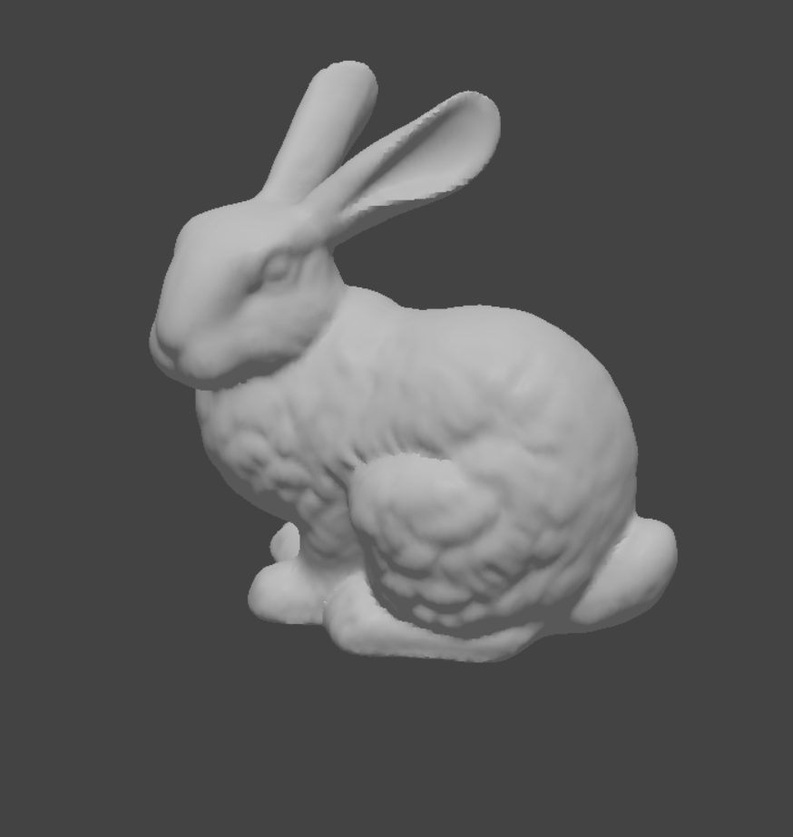
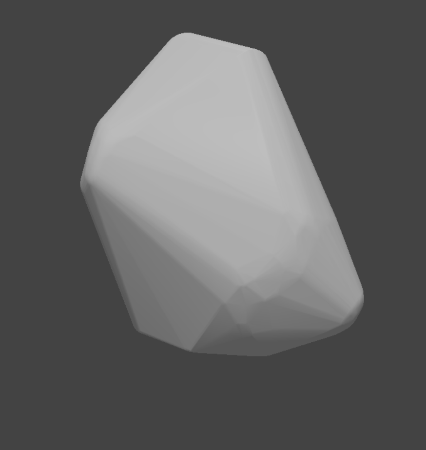
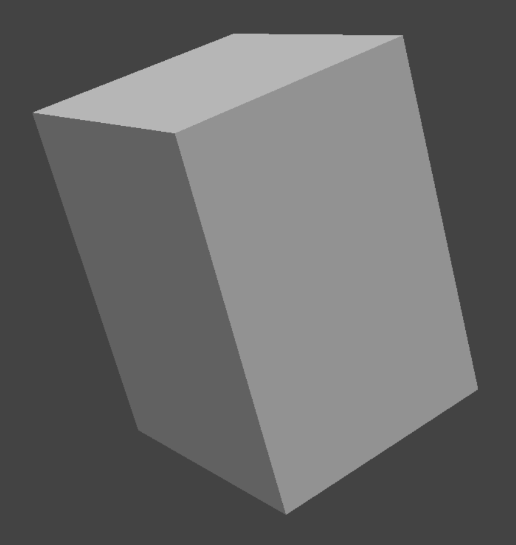

## Installation

Windows users can find a packaged version in release

Mac and unix users are free to compile the kit from source.  

## Building

Here I will just detail the steps I took to download dependencies and compile the final plug-in, so mind these are the steps I took for Windows 64bit

Following instructions at https://doc.cgal.org/latest/Manual/windows.html#sec-installing-with-vcpkg

Open a terminal to the root of this kit

Get and install vcpkg, a package manager for windows,

```
git clone https://github.com/microsoft/vcpkg
cd vcpkg
bootstrap-vcpkg.bat
```

Then using vcpkg install cgal to get all dependencies for it

```
vcpkg.exe install yasm-tools:x86-windows
vcpkg.exe install cgal:x64-windows
vcpkg.exe install eigen3:x64-windows
```

Installation will take quite some time, around 30 minutes for me

Run cmake-gui and find `vcpkg.cmake` for "Specify Toolchain for Cross-compiling" like the CGAL example shows, set the cmake path to the LXSDK

Configure and Generate the project.

## Usage

Kit will currently expose two new commands to Modo,

- ucx.new, for making a new mesh item with a convex hull of the first selected mesh
- ubx.new, making an optimized bounding box of the first selected mesh

Given a selected source mesh



Users can run `ucx.new` to create a new mesh item like



Or `ubx.new` for making an optimized fitted bounding box around the model



Model used was the Stanford Bunny provided by Stanford Computer Graphics Laboratory, http://graphics.stanford.edu/data/3Dscanrep/
